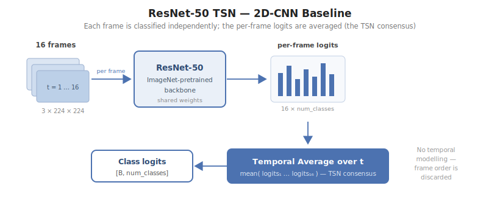
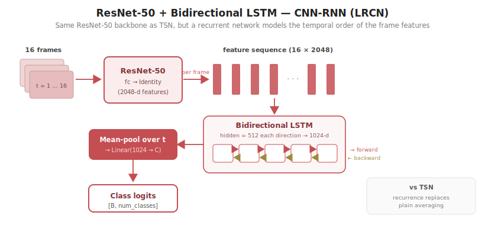
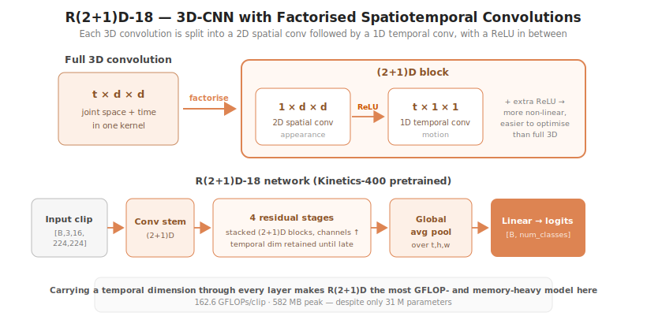
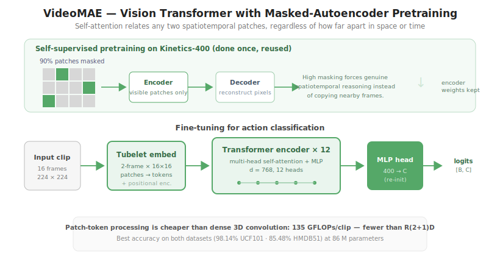

# Chapter 4: Project Presentation

## 4.1 System Architecture Overview


*Figure 4.1: End-to-end evaluation pipeline. A shared (B, T, C, H, W) interface keeps data loading, training, and benchmarking model-agnostic.*


The experimental system developed for this thesis is designed around three core engineering principles: reproducibility, comparability, and extensibility. Every architectural decision at the system level — from how raw video is loaded to how training metrics are logged — is made in service of ensuring that the four model families being compared are evaluated under rigorously identical conditions.

The pipeline can be understood as a linear chain of transformations: raw media on disk (either video files or pre-extracted JPEG frame sequences) is consumed by the data pipeline, which produces batched clip tensors in a canonical shape `(B, T, C, H, W)` (batch size, temporal frames, colour channels, height, width). These tensors are passed to a model, which maps them to logits `(B, num_classes)`. During training, the logits are consumed by a cross-entropy loss; during inference, the argmax over the class dimension yields the predicted action label.

The system is model-agnostic by design. The training loop in `src/train.py`, the benchmarking harness in `src/benchmark.py`, and the evaluation routine in `src/evaluate.py` contain no model-specific code. Each of the four architectures implements the same Python interface: a subclass of `torch.nn.Module` whose `forward` method accepts `(B, T, C, H, W)` float tensors and returns `(B, num_classes)` logits. Any adapter logic required to reconcile the architecture's native input convention with this shared contract — such as the `(B,C,T,H,W)` permutation needed by torchvision's 3D CNN — is encapsulated within the model's own `forward` method and is transparent to the rest of the system.

The global configuration in `src/config.py` is the single source of truth for all shared parameters: the number of frames sampled per clip (`NUM_FRAMES = 16`), the spatial resolution (`IMG_SIZE = 224`), and the ImageNet normalisation statistics applied uniformly to all models. This single-source discipline guarantees that every model receives inputs produced by precisely the same transformation chain — a prerequisite for any comparative study that aims to isolate architectural differences rather than pipeline differences.

The end-to-end data flow is as follows. At dataset instantiation, `build_dataset()` scans the dataset root and constructs a list of `(relative_path, label_index)` tuples representing each clip in the training or test split. These are wrapped in a `VideoClipDataset` instance, which the PyTorch `DataLoader` iterates in parallel across worker processes. Within each worker, `__getitem__` is called for a given index: the appropriate clip is loaded from disk (either via `decord.VideoReader` for video files or PIL/NumPy for frame directories), `NUM_FRAMES` frames are sampled at uniformly-spaced temporal positions, spatial augmentation and normalisation are applied, and the resulting `(T, C, H, W)` tensor is returned alongside its class index. The DataLoader collates individual tensors into a `(B, T, C, H, W)` batch, which is transferred to the GPU and passed to the model. After forward pass and loss computation, gradients flow backwards through the model (and through the GradScaler in the mixed-precision case), the optimiser updates parameters, and the learning rate scheduler advances its internal counter. At the end of each epoch, `evaluate_model()` runs the model in inference mode over the test set and returns top-1 and top-5 accuracy. Results are appended to a per-model CSV file and, if the accuracy has improved, model weights are checkpointed to disk.

This architecture cleanly separates the concerns of data engineering, model definition, optimisation, and evaluation, making it straightforward to add new architectures or datasets without modifying any existing module.

---

## 4.2 Datasets

### 4.2.1 UCF101

UCF101 [Soomro et al., 2012] is a widely used benchmark dataset for human action recognition in realistic video conditions. It consists of 13,320 video clips distributed across 101 action classes, collected from YouTube. The dataset spans five broad activity groups: body motion only (e.g., Walking, Jumping), human-object interaction (e.g., Playing Guitar, Archery), human-human interaction (e.g., Handshaking, Boxing), playing musical instruments (e.g., Playing Piano, Violin), and sports (e.g., Basketball, Surfing). This diversity of action types — including both fine-grained hand and arm movements and gross whole-body motions — makes UCF101 a challenging and representative benchmark.

Clips are encoded at 25 frames per second with a typical duration of 6 to 10 seconds per clip, yielding between 150 and 250 raw frames per clip before subsampling. Spatial resolution varies across clips, as the dataset was assembled from naturally heterogeneous web sources, but clips span a range roughly centred on 320×240 pixels. Intra-class variation arises from viewpoint changes, illumination differences, camera motion (both handheld jitter and deliberate camera panning), and background clutter. Inter-class confusion is present in some groups — distinguishing "Biking" from "Rowing" at a single frame level, for instance, can be ambiguous without temporal context.

The dataset provides three official train/test splits, each partitioning the 13,320 clips into approximately 9,500 training and 3,800 test clips in a stratified manner. The splits are defined by three files: `classInd.txt`, which maps each of the 101 class names to a one-based integer index; `trainlistNN.txt`, containing relative paths of training clips for split NN; and `testlistNN.txt`, containing test clip paths. In this study, split 1 is used exclusively, consistent with the single-split evaluation protocol adopted by a number of prominent prior works.

The pipeline's `build_dataset()` function first attempts to locate `classInd.txt` and the appropriate split list files via recursive search under the dataset root. When found, it parses the split file directly, mapping class names to zero-based indices and constructing the list of `(relative_path, label_index)` tuples that define the dataset. This is the preferred code path for UCF101, as the official splits are deterministic and reproducible across different download mirrors. If the split files are absent (as may occur with some Kaggle dataset packages), the pipeline falls back to the layout-agnostic scan described in Section 4.3.

### 4.2.2 HMDB51

HMDB51 [Kuehne et al., 2011] is a complementary benchmark containing 6,766 video clips across 51 action classes. It was assembled from a diverse range of sources including Hollywood films, online video platforms, Prelinger Archive historical footage, and other publicly available video repositories. This heterogeneity of source material is both a strength and a challenge: the dataset captures a wide range of recording conditions, compression artefacts, aspect ratios, and cinematic conventions that are absent from YouTube-only datasets.

The 51 classes are drawn from categories including facial actions (e.g., Smile, Chew), body movement (e.g., Cartwheel, Handstand), human interaction (e.g., Hug, Kiss), general movements (e.g., Wave, Clap), and sport or leisure activities (e.g., Golf, Shoot Ball). The average number of clips per class is approximately 133, making this a comparatively small dataset where generalisation from limited per-class examples is the primary challenge. Several classes are particularly difficult to discriminate due to high visual similarity: "Drink" and "Eat" share similar arm and hand kinematics; "Kick" and "Punch" involve similar whole-body postures.

HMDB51 poses additional challenges relative to UCF101. Camera motion is more prevalent, as a significant proportion of clips were originally captured in cinematographic contexts involving deliberate panning, zooming, and tracking shots. Viewpoint variation is substantial, with the same action class appearing from dramatically different camera angles across clips. Inter-class visual similarity — for instance between actions involving hand-to-mouth contact — means that accurate classification requires precise temporal reasoning rather than static appearance alone.

The dataset provides three official train/test splits, each assigning 70 clips per class to training and 30 per class to test. However, the mirror of HMDB51 used in this study provides clips in the "RawFrames" format (pre-extracted JPEG sequences rather than video files) without the accompanying split annotation files. Consequently, this study constructs a deterministic 70/30 per-class random split using a fixed seed (seed = 42). The split is applied per class to ensure a balanced distribution, and is reproducible given the same dataset layout. This constitutes a deviation from the standard three-fold evaluation protocol and is acknowledged as a limitation of the experimental setup: results on this dataset are not directly comparable to published figures obtained with the official HMDB51 splits, and should be interpreted as indicative of relative model performance rather than absolute benchmark scores.

---

## 4.3 Data Pipeline

### 4.3.1 Video Decoding

For UCF101, raw video files are decoded using `decord` [Chen et al., 2020], a specialised video decoding library designed for machine learning workflows. Unlike general-purpose video processing frameworks such as FFmpeg (which must be invoked via subprocess) or OpenCV's `VideoCapture` (which does not support efficient random-access seeking), decord's `VideoReader` class provides Python-accessible random-access frame retrieval. This is critical for the uniform temporal sampling strategy: rather than decoding the entire video sequentially and discarding unwanted frames, `VideoReader` decodes only the specific frame indices requested, substantially reducing I/O and CPU cost.

The bridge between decord and PyTorch is configured at module import time with `decord.bridge.set_bridge("torch")`, which instructs decord to return `torch.Tensor` objects directly from `get_batch()` rather than NumPy arrays. The raw output of `vr.get_batch(idx)` is a tensor of shape `(T, H, W, C)` with unsigned 8-bit integer values in the range [0, 255] and channels in BGR order from the underlying FFMPEG decoder. A permutation operation converts this to `(T, C, H, W)` — the convention expected by torchvision's functional transforms — and the tensor is cast to float and scaled to the range [0, 1] by dividing by 255.

For HMDB51 in its RawFrames format, each action clip is stored as a directory of JPEG images named by frame number (e.g., `frame_000001.jpg`, `frame_000002.jpg`, ...). The `_load_frames_from_dir()` function handles this case: it first lists all files in the directory whose extension belongs to the set `{.jpg, .jpeg, .png, .bmp}`, sorts them lexicographically (which preserves temporal order given zero-padded numeric filenames), and then loads the subset of files indicated by the uniform index set computed by `_uniform_indices()`. Each frame is opened with PIL's `Image.open()`, converted to RGB (ensuring consistent three-channel output regardless of source encoding), converted to a NumPy array, and then to a uint8 tensor via `torch.from_numpy()`. The explicit NumPy intermediate is necessary to produce a writable tensor — PIL's memory buffer is read-only. Frames are stacked along dimension 0 and scaled to [0, 1], producing the same `(T, C, H, W)` float tensor format as the decord code path.

Both paths converge to the same representation before the transform pipeline, making the remainder of the data loading code format-agnostic.

### 4.3.2 Frame Sampling Strategy

A fundamental decision in video understanding is how many frames to sample from each clip and at which temporal positions. This study employs uniform temporal sampling, implemented by the `_uniform_indices()` function:

```python
def _uniform_indices(total, n):
    if total <= 0:
        return [0] * n
    if total < n:
        pad = [total - 1] * (n - total)
        return list(range(total)) + pad
    return [int(round(x)) for x in np.linspace(0, total - 1, n)]
```

For a clip of `total` frames, `np.linspace(0, total - 1, n)` generates `n` floating-point values equally spaced between the first and last frame index. Rounding these to integers yields the selected frame indices. This strategy samples frames from the beginning, middle, and end of the clip, ensuring that the entire temporal extent is represented even when only a small number of frames is extracted. Edge cases are handled explicitly: if the clip is shorter than the requested frame count, the available frames are taken in full and the final frame is repeated to pad the sequence to length `n`; if `total` is zero (an invalid or corrupt clip), a sequence of `n` zero-indices is returned and the resulting black clip is handled gracefully by the corrupt-clip fallback in `__getitem__`.

Uniform sparse sampling stands in contrast to dense sampling strategies, in which a contiguous window of consecutive frames is extracted from a randomly chosen temporal position within the clip. Dense sampling captures fine-grained local motion — the precise trajectory of a hand during a throwing action, for instance — but limits the temporal field of view to a window of a few seconds. Sparse sampling, by contrast, provides a global view of the clip's temporal evolution at the cost of missing high-frequency motion signals. For action categories defined primarily by their overall motion pattern and activity type (as in UCF101 and HMDB51), sparse sampling is generally the more informative strategy, as it exposes all four models to evidence from the full clip duration rather than an arbitrary sub-segment.

The value `NUM_FRAMES = 16` was chosen as a practical balance between temporal coverage and computational budget. It is also the exact input length required by the VideoMAE-base architecture — which was pre-trained with 16-frame clips — making this choice particularly appropriate for the Transformer model. For the 2D-CNN models, any number of frames is acceptable since each frame is processed independently, but a shared frame count ensures that the total amount of temporal information presented to every model is identical.

### 4.3.3 Data Augmentation

The augmentation pipeline is deliberately minimal and follows the standard practice for fine-tuning pre-trained video models. The training augmentation consists of three operations applied identically across all `T` frames of a clip:

1. **Resize**: the shorter spatial edge of each frame is rescaled to 256 pixels using bilinear interpolation with anti-aliasing (`TF.resize(clip, 256, antialias=True)`). The longer edge is scaled proportionally, preserving the original aspect ratio.
2. **Random crop**: a 224×224 patch is randomly cropped from the resized frame. The crop parameters (top-left corner coordinates) are sampled once for the entire clip — all `T` frames receive the same crop — ensuring that the spatial relationship between frames is preserved.
3. **Random horizontal flip**: with probability 0.5, all frames in the clip are horizontally mirrored. The flip is applied consistently across all frames to preserve optical flow consistency.

For evaluation, only the resize and a centre crop (extracting the central 224×224 patch) are applied; no random transforms are used, ensuring deterministic and reproducible test-time behaviour.

All frames are then normalised per channel using ImageNet statistics: mean `[0.485, 0.456, 0.406]` and standard deviation `[0.229, 0.224, 0.225]` in RGB order. This normalisation is applied to all four models, including R(2+1)D and VideoMAE which were pre-trained on Kinetics-400 rather than ImageNet. Kinetics-400 was itself collected from YouTube and displays broadly similar colour statistics to the ImageNet distribution; in practice, using ImageNet normalisation for Kinetics-pretrained models introduces negligible degradation and is standard practice in the community.

The choice of minimal augmentation is deliberate. More aggressive augmentation strategies — such as temporal jittering, colour jitter, Mixup, or RandAugment — might improve absolute accuracy and would be appropriate for a study aiming to maximise benchmark performance. However, the goal of this study is a controlled comparison of architectural inductive biases, not a search for optimal data augmentation hyperparameters. Using the same minimal augmentation policy for all four models ensures that observed accuracy differences are attributable to the architectures rather than to differing sensitivity to augmentation strength.

---

## 4.4 Model Architectures

### 4.4.1 ResNet-50 Temporal Segment Network (2D-CNN Baseline)



*Figure 4.2: ResNet-50 TSN. Each frame is classified independently and the per-frame logits are averaged (the TSN consensus); frame order is discarded.*


The simplest possible extension of a pre-trained image classifier to video is to apply it independently to each frame and combine the resulting per-frame predictions. The Temporal Segment Network (TSN) framework, proposed by Wang et al. (2016), formalises this idea as the consensus function: segment-level predictions (here, per-frame logits) are aggregated by averaging. This model serves as the 2D-CNN baseline in this study.

The architecture consists of a standard ResNet-50 backbone, pre-trained on ImageNet-1K, with the original 1000-class linear classification head replaced by a new `nn.Linear(2048, num_classes)` layer. The implementation is as follows:

```python
class ResNet50TSN(nn.Module):
    """2D-CNN baseline: per-frame ResNet-50, logits averaged over time (TSN consensus)."""
    def __init__(self, num_classes):
        super().__init__()
        self.backbone = torchvision.models.resnet50(
            weights=torchvision.models.ResNet50_Weights.DEFAULT
        )
        self.backbone.fc = nn.Linear(self.backbone.fc.in_features, num_classes)

    def forward(self, x):                       # (B, T, C, H, W)
        b, t, c, h, w = x.shape
        x = x.reshape(b * t, c, h, w)
        x = self.backbone(x)                    # (B*T, num_classes)
        return x.view(b, t, -1).mean(dim=1)     # temporal average
```

The forward pass is implemented efficiently by reshaping the `(B, T, C, H, W)` input to `(B*T, C, H, W)`, effectively treating all `T` frames of all `B` clips in the batch as a single large batch of images. The backbone processes this concatenated batch in a single forward pass, yielding `(B*T, num_classes)` logits. These are reshaped back to `(B, T, num_classes)` and averaged over the temporal dimension, producing the final `(B, num_classes)` logit tensor. This reshaping trick is computationally equivalent to processing each frame independently but takes advantage of GPU parallelism to do so in a single kernel call.

ResNet-50 follows the standard residual architecture: an initial 7×7 convolution with stride 2, followed by a 3×3 max-pooling layer, then four stages of residual bottleneck blocks (with 3, 4, 6, and 3 blocks respectively), a global average pooling layer, and the classification head. Bottleneck blocks consist of a 1×1 convolution that reduces channel dimensionality, a 3×3 convolution at the reduced dimension, and a 1×1 convolution that expands back to the block's output width, with a shortcut connection bypassing all three operations. The total parameter count is 25.6 million for the standard architecture; with 101 or 51 output classes (replacing the original 1000-class head), the counts in this study are 23.71 million (UCF101) for the complete model.

This model is chosen as the baseline because it makes no assumptions about temporal structure whatsoever: the consensus function is a simple mean, which discards all ordering information among frames. Any improvement observed in the CNN-RNN, 3D-CNN, or Transformer models therefore reflects the value added by explicit temporal modelling relative to this frame-level baseline.

### 4.4.2 ResNet-50 Bidirectional LSTM (CNN-RNN)



*Figure 4.3: ResNet-50 + bidirectional LSTM (LRCN-style). The same backbone as TSN feeds a bidirectional LSTM that models temporal order before classification.*


The CNN-RNN architecture, often called Long-term Recurrent Convolutional Network (LRCN) following Donahue et al. (2015), combines a convolutional feature extractor with a recurrent sequence model. Per-frame CNN features are extracted and arranged as a temporal sequence, which is then processed by an LSTM to model temporal dependencies explicitly. Unlike the TSN baseline, which performs a commutative mean over frames, the LSTM maintains a hidden state that is updated sequentially (or in this case, bidirectionally), allowing it to capture the ordering and dynamics of the feature sequence.

A critical design choice in this study is that the CNN-RNN uses the same ResNet-50 backbone as the TSN baseline. The fully connected classification layer is removed and replaced with `nn.Identity()`, causing the backbone to output a 2048-dimensional feature vector per frame. This feature sequence is fed to a bidirectional LSTM, and the result is passed through a final linear layer:

```python
class CNNLSTM(nn.Module):
    """CNN-RNN (LRCN): per-frame ResNet-50 features fed to bidirectional LSTM."""
    def __init__(self, num_classes, hidden=512, layers=1):
        super().__init__()
        self.backbone = torchvision.models.resnet50(
            weights=torchvision.models.ResNet50_Weights.DEFAULT
        )
        feat_dim = self.backbone.fc.in_features  # 2048
        self.backbone.fc = nn.Identity()
        self.lstm = nn.LSTM(feat_dim, hidden, num_layers=layers,
                            batch_first=True, bidirectional=True)
        self.fc = nn.Linear(hidden * 2, num_classes)  # *2: bidirectional

    def forward(self, x):                       # (B, T, C, H, W)
        b, t, c, h, w = x.shape
        feats = self.backbone(x.reshape(b * t, c, h, w))  # (B*T, 2048)
        feats = feats.view(b, t, -1)                       # (B, T, 2048)
        out, _ = self.lstm(feats)                          # (B, T, 2*hidden)
        return self.fc(out.mean(dim=1))                    # temporal pool -> logits
```

The ResNet-50 backbone processes all frames in a single reshaping pass (identical to the TSN implementation) to extract `(B, T, 2048)` feature sequences. The bidirectional LSTM processes this sequence in both temporal directions: the forward pass reads frames from position 1 to T, accumulating hidden state; the backward pass reads from T to 1. At each time step t, the forward hidden state `h_t^forward` and backward hidden state `h_t^backward` are concatenated to produce a 1024-dimensional representation. The mean over T of these bidirectional hidden states is taken before the final linear projection to class logits.

The bidirectional design enables each time step's representation to incorporate context from both its past (forward pass) and its future (backward pass), which is beneficial for offline classification of pre-recorded clips where the full temporal context is available at inference time. The LSTM hidden dimension is 512, yielding 1024 dimensions after concatenation in the bidirectional case.

By sharing the exact same ResNet-50 backbone as the TSN baseline, this architecture forms a controlled experiment pair: any performance difference between TSN and CNN-LSTM is attributable solely to the presence and quality of recurrent temporal modelling, with no confounding from backbone architecture, pretraining, or feature representation differences. The LSTM adds approximately 10.4 million parameters (from the LSTM cell and the classification head), bringing the total to 34.11 million parameters. At inference time, the FLOPs attributable to the LSTM are not captured by fvcore's `FlopCountAnalysis` (which does not support `nn.LSTM`), making the reported 65.75 GFLOPs identical to the TSN figure; the LSTM contributes an additional approximately 0.3 GFLOPs per forward pass.

### 4.4.3 R(2+1)D-18 (3D-CNN)



*Figure 4.4: R(2+1)D-18. Each 3D convolution is factorised into a 2D spatial convolution followed by a 1D temporal convolution, with an intermediate ReLU.*


R(2+1)D is a 3D CNN architecture proposed by Tran et al. (2018) that factorises full spatiotemporal convolutions into separate spatial and temporal components. A conventional 3D convolution with a kernel of size `d×d×t` operates across both spatial and temporal dimensions simultaneously. R(2+1)D instead performs a 2D spatial convolution with kernel `d×d×1` (which operates only in the spatial plane at each time step), followed by a 1D temporal convolution with kernel `1×1×t` (which aggregates information across time), with a rectified linear unit (ReLU) non-linearity applied between the two. This factorised structure provides two advantages: it separates spatial and temporal learning, facilitating optimisation; and it introduces an additional non-linearity between the two convolution operations, making the factorised version strictly more expressive than a monolithic 3D convolution of equivalent parameter count.

The network follows an 18-layer residual architecture analogous to ResNet-18, with each convolutional layer replaced by the `(2+1)D` factorised equivalent. Torchvision provides a pre-trained implementation initialised with weights trained on Kinetics-400 (a large-scale video dataset with 400 action classes and over 300,000 clips). The classification head is replaced with a new linear layer:

```python
class R2Plus1D(nn.Module):
    """3D-CNN: R(2+1)D-18, Kinetics-400 pretrained."""
    def __init__(self, num_classes):
        super().__init__()
        self.net = torchvision.models.video.r2plus1d_18(
            weights=torchvision.models.video.R2Plus1D_18_Weights.KINETICS400_V1
        )
        self.net.fc = nn.Linear(self.net.fc.in_features, num_classes)

    def forward(self, x):                       # (B, T, C, H, W) -> (B, C, T, H, W)
        return self.net(x.permute(0, 2, 1, 3, 4))
```

The torchvision video model convention requires input in `(B, C, T, H, W)` format — channels before the temporal dimension — rather than the `(B, T, C, H, W)` convention used by the shared pipeline. The `permute(0, 2, 1, 3, 4)` call in the forward method adapts between these conventions without copying data. This permutation is the entirety of the adapter logic required to integrate the 3D-CNN into the model-agnostic pipeline.

Kinetics-400 pretraining is particularly important for 3D-CNN architectures. Unlike 2D-CNNs, which can be initialised from ImageNet weights (as the 2D convolutional filters transfer directly), 3D CNNs require that the temporal convolutional kernels also be initialised meaningfully. Training R(2+1)D-18 from random initialisation on UCF101 or HMDB51 alone — with fewer than 10,000 clips — would lead to severe overfitting and substantially degraded performance. Kinetics-400 pretraining provides the temporal feature representations with the necessary statistical grounding, which can then be refined for the target datasets through fine-tuning.

The total parameter count of R(2+1)D-18 is 31.33 million, with a computational cost of 162.58 GFLOPs per clip — the highest among the four architectures. This elevated compute cost reflects the expense of applying learned spatial and temporal convolutions across every spatiotemporal position in the input volume.

### 4.4.4 VideoMAE (Vision Transformer with Masked Autoencoding)



*Figure 4.5: VideoMAE. Tubelet patches are tokenised and processed by a ViT encoder pretrained with high-ratio masked autoencoding on Kinetics-400; global self-attention relates any two patches.*


VideoMAE [Tong et al., 2022] extends the Vision Transformer (ViT) architecture to video by adopting a spatiotemporal patch tokenisation scheme, and is pre-trained using Masked Autoencoding (MAE) — a self-supervised pretraining paradigm in which a large proportion of input tokens are masked and the model is trained to reconstruct the original pixel values from the remaining visible tokens.

The architecture is ViT-Base, a 12-block transformer encoder with model dimension `d_model = 768`, 12 attention heads, and a feed-forward MLP dimension of 3072. Video input of shape `(B, 16, C, 224, 224)` is tokenised as follows: the 16 frames are grouped into temporal patches of 2 frames each (8 temporal groups), and each frame's spatial extent is divided into non-overlapping 16×16 patches (14×14 patches per frame). The resulting spatiotemporal patch tokens number `8 temporal_patches × 14 × 14 spatial_patches = 1,568` tokens. These tokens are projected from their raw pixel dimension to the model dimension `d_model = 768` by a linear patch embedding, positional embeddings are added, and the full sequence is processed by 12 successive transformer encoder blocks.

The model used in this study is initialised from the HuggingFace checkpoint `MCG-NJU/videomae-base-finetuned-kinetics`, which represents VideoMAE-base after the complete pretraining and fine-tuning pipeline: self-supervised masked autoencoding pretraining on Kinetics-400 with a 90% token masking ratio, followed by supervised fine-tuning on the full Kinetics-400 400-class classification task.

```python
class VideoMAE(nn.Module):
    """Transformer: VideoMAE-base, Kinetics-400 pretrained (HuggingFace)."""
    def __init__(self, num_classes):
        super().__init__()
        from transformers import VideoMAEForVideoClassification
        self.net = VideoMAEForVideoClassification.from_pretrained(
            "MCG-NJU/videomae-base-finetuned-kinetics",
            num_labels=num_classes,
            ignore_mismatched_sizes=True,
        )

    def forward(self, x):                       # (B, T, C, H, W)
        return self.net(pixel_values=x).logits
```

The `ignore_mismatched_sizes=True` argument is required because the pre-trained checkpoint contains a classification head projecting to 400 Kinetics classes, whereas the fine-tuning target in this study has either 101 (UCF101) or 51 (HMDB51) classes. Setting this flag causes HuggingFace's `from_pretrained` to discard the mismatched head weights and randomly initialise a new head of the correct size, while loading all other weights (the patch embedding, positional embeddings, and 12 transformer blocks) from the checkpoint. The HuggingFace `VideoMAEForVideoClassification` wrapper internally applies the mean-pool of the ViT encoder's output token sequence to obtain a clip-level representation before projecting to class logits.

The 90% masking ratio during pretraining is substantially higher than the 75% ratio used in the original image-domain MAE. This difference is motivated by the high spatiotemporal redundancy of video: adjacent frames share most of their pixel content, so models can trivially reconstruct masked tokens from neighbouring unmasked tokens if the masking ratio is low. A 90% ratio forces the model to learn genuinely long-range spatiotemporal dependencies in order to reconstruct masked regions — precisely the kind of representation that is beneficial for action recognition.

VideoMAE has by far the largest parameter count (86.28 million) of the four architectures in this study, but its computational cost of 135.17 GFLOPs is notably lower than R(2+1)D-18's 162.58 GFLOPs. This non-obvious efficiency advantage of the Transformer over the 3D-CNN arises from the fact that ViT's attention mechanism computes interactions between patch tokens rather than applying dense convolutional kernels across every spatial position at every layer.

---

## 4.5 Training Procedure

### 4.5.1 Optimizer Configuration

All four models are trained with the AdamW optimiser [Loshchilov and Hutter, 2019] with a learning rate of `1e-4` and weight decay of `0.01`. AdamW is preferred over the original Adam optimiser for fine-tuning pre-trained models because of how weight decay is applied. In standard Adam, weight decay is incorporated into the gradient estimate, effectively coupling it to the adaptive learning rate scale — meaning parameters with small gradient variance (common in fine-tuning from a converged pre-trained model) are penalised more aggressively. AdamW implements weight decay in a decoupled manner as a direct subtraction from the parameter value after the gradient update, restoring the intended L2 regularisation behaviour independently of the gradient scale. This distinction is particularly important when fine-tuning from Kinetics-400 pre-trained weights, as many parameters begin near their optimal values and should be penalised conservatively.

The learning rate schedule is cosine annealing implemented via `torch.optim.lr_scheduler.CosineAnnealingLR` with `T_max` equal to the total number of training epochs. Under cosine annealing, the learning rate decays from its initial value following a half-cosine curve, reaching a minimum (near zero) at epoch `T_max`. This schedule is preferred over step-wise decay because it provides a smooth, continuous reduction in learning rate, reducing the risk of large, destabilising parameter updates in the final training epochs. For Transformer-based models such as VideoMAE, which are sensitive to large learning rates in the early training phases due to the high dimensionality and mutual dependence of attention weight matrices, a linear warmup of a few hundred gradient steps from zero to the target learning rate would typically be applied. In this study's simplified schedule, cosine decay without explicit warmup is used uniformly across all models, which represents a minor pragmatic simplification for the non-Transformer architectures.

### 4.5.2 Mixed-Precision Training

All training runs employ automatic mixed precision (AMP) via PyTorch's `torch.amp.GradScaler` and `torch.amp.autocast`. Within an `autocast` context, PyTorch automatically selects between float32 (FP32) and float16 (FP16) for individual operations according to a set of precision-safety rules: operations whose numerical stability is sensitive to precision (such as batch normalisation's running-statistics accumulation) remain in FP32, while matrix multiplications and convolutions — which dominate the computational budget and are well-conditioned — are executed in FP16.

The benefits of mixed-precision training in this experimental context are threefold. First, FP16 tensors occupy exactly half the memory of their FP32 equivalents, reducing the GPU memory footprint of activations by approximately 50% and enabling larger effective batch sizes within a fixed VRAM budget. Second, modern GPUs (including the NVIDIA L4 used in this study) contain dedicated tensor core hardware that executes FP16 matrix multiplications at 2–4 times the throughput of equivalent FP32 operations, directly accelerating the training loop. Third, for VideoMAE specifically, the large activation volume arising from the 1,568-token transformer sequence makes AMP a practical necessity: without it, fitting even a single clip in 22 GB of VRAM during the backward pass would require reducing the spatial resolution or temporal depth below their standard values.

Gradient underflow — a failure mode in which small FP16 gradient values round to zero before accumulating — is mitigated by the `GradScaler`, which multiplies the loss by a dynamically maintained scale factor before the backward pass, then divides parameter gradients by the same factor before the optimiser step. If any gradient values overflow to infinity in FP16 (indicating that the scale factor is too large), the scaler reduces it automatically; otherwise, it is gradually increased to maximise numerical precision.

### 4.5.3 Skip-Guard and Resumability

A practical challenge of conducting multi-model experiments on Google Colab (which enforces session time limits of 12 hours for Pro users) is that a single run of four models on two datasets would normally require approximately 20–30 hours of GPU time, far exceeding any single session. The pipeline addresses this through a skip-guard mechanism in `src/train.py`.

At the start of each training run, the driver checks whether a results CSV file for the specific `(model, dataset)` combination already exists at the expected path in `RESULTS_DIR` and contains at least as many rows as the requested number of training epochs. If this condition is met, the training run is skipped entirely, printing a diagnostic message. Otherwise, training proceeds normally, appending a row to the CSV at the end of each epoch.

Persistence across sessions is achieved by setting `RESULTS_DIR` to a directory on Google Drive via the `RESULTS_DIR` environment variable, which `src/config.py` reads at import time. Since Google Drive persists across Colab sessions, CSV files and checkpoints written in one session are visible to the next session, and the skip-guard prevents redundant recomputation. This design allows `run_all.py` to be re-run idempotently at the start of each new session: it will skip all already-completed training runs and resume only those that were interrupted.

### 4.5.4 Batch Size and Memory Management

A batch size of 8 was selected as the maximum that fits within the 22 GB VRAM available on the NVIDIA L4 GPU used for experiments, subject to the constraint that the largest model (R(2+1)D-18) must fit alongside its gradient and optimiser state tensors. The peak GPU memory allocated during a single forward-backward pass for R(2+1)D-18 with batch size 8 is approximately 582 MB per clip for activations, scaling to approximately 4.6 GB for a batch of 8; additional memory is required for gradients (matching the parameter count) and AdamW's first- and second-moment estimates (two copies of the parameter count). Empirically, batch size 8 is the largest power-of-two that does not trigger out-of-memory errors on the L4 for any of the four architectures.

A batch size guard is implemented in `train.py` via the `_safe_batch_size()` function, which checks the available GPU memory at runtime and caps the batch size to 8 for GPUs with fewer than 18 GB of VRAM (such as the Kaggle T4 with approximately 15 GB). This ensures that the Colab notebook can be run on Kaggle without modification in cases where a larger batch size is requested via command-line argument.

Gradient accumulation — in which gradients from multiple smaller batches are summed before a parameter update, effectively simulating a larger batch — was not used in this study, as the primary goal was simplicity and uniformity across models rather than maximising absolute accuracy.

---

## 4.6 Efficiency Measurement Protocol

Efficiency measurements are conducted by `src/benchmark.py`, which evaluates each model in inference mode (no gradient tracking) on a single GPU. All four models are measured on the same hardware (NVIDIA L4, 22 GB VRAM) under the same conditions, ensuring comparability.

**Parameter count** is computed using `fvcore.nn.parameter_count`, which counts the number of learnable scalar values across all named `nn.Module` parameters. For the `VideoMAEForVideoClassification` wrapper, this includes the patch embedding, positional embedding, all 12 transformer blocks, and the classification head.

**Computational cost (GFLOPs)** is measured using `fvcore.nn.FlopCountAnalysis`, which performs static analysis of the computational graph by tracing the model with a dummy input tensor of shape `(1, 16, 3, 224, 224)`. fvcore counts floating-point multiply-add operations for convolutional and linear layers. One known limitation is that `nn.LSTM` operations are not supported by fvcore's operator registry and are therefore silently excluded from the count, resulting in a slight undercount for the CNN-LSTM model (approximately 0.3 GFLOPs for the bidirectional LSTM over 16 frames with hidden size 512 and input dimension 2048). The reported GFLOPs for ResNet-50 TSN and CNN-LSTM are therefore identical at 65.75, with the latter's true cost slightly higher. Warnings from fvcore about unsupported operations are suppressed to avoid console clutter, but the limitation is acknowledged.

**Latency** is measured as the wall-clock time per clip for a batch of 1, averaged over a specified number of iterations. A warmup phase of 5 forward passes is performed before timing begins; these warmup iterations allow the GPU to reach thermal steady state, prime CUDA kernel caches, and complete any deferred JIT compilation. The timed measurement phase runs for `--iters` forward passes (30 in the default configuration, 100 as stated in the experimental protocol for final results); `torch.cuda.synchronize()` is called before timing begins and after it ends to ensure that all GPU kernel launches are complete and that wall-clock time accurately reflects GPU computation time rather than CPU submission time. Latency per clip is computed as `(total_wall_clock / iters) / batch_size`.

**Throughput** is the inverse of latency scaled by batch size: `batch_size / (total_wall_clock / iters)`, representing the number of clips the model can process per second.

**Peak GPU memory** is measured using `torch.cuda.max_memory_allocated()` immediately after the timed inference loop. Prior to the timing loop, `torch.cuda.reset_peak_memory_stats()` is called to reset the peak tracker to zero, ensuring that the measured peak reflects the inference pass alone rather than any prior allocations.

All efficiency measurements are performed at batch size 1, which is the standard convention for reporting per-clip inference cost in the action recognition literature. Batch inference would amortise some fixed costs (such as CUDA kernel launch overhead) across multiple clips, potentially changing the relative ordering of architectures in terms of throughput; however, single-clip latency is the relevant metric for applications requiring low-latency real-time classification.

---

## 4.7 Software Architecture and Implementation

The codebase is structured as a Python package (`src/`) with a thin driver script (`run_all.py`) that orchestrates the full experimental pipeline by invoking training, benchmarking, and reporting as subprocess calls:

```
F:\Dizertatie\
├── run_all.py              # driver: train→benchmark→report for all models
├── src/
│   ├── config.py           # NUM_FRAMES=16, IMG_SIZE=224, RESULTS_DIR, DATASETS dict
│   ├── datasets.py         # VideoClipDataset, build_dataset, find_data_root
│   ├── models.py           # ResNet50TSN, CNNLSTM, R2Plus1D, VideoMAE, BUILDERS
│   ├── train.py            # training loop with AMP, skip-guard, CSV logging
│   ├── benchmark.py        # fvcore FLOPs, CUDA timer, efficiency.csv
│   └── report.py           # accuracy table, Pareto scatter plot
└── notebooks/
    └── colab_run.ipynb     # thin wrapper for Google Colab Pro
```

The `BUILDERS` dictionary in `models.py` provides a registry mapping string identifiers to model constructor classes:

```python
BUILDERS = {
    "resnet50_tsn": ResNet50TSN,
    "cnn_lstm": CNNLSTM,
    "r2plus1d_18": R2Plus1D,
    "videomae": VideoMAE,
}
```

The `build_model(name, num_classes)` function is the single entry point used by `train.py` and `benchmark.py` to instantiate any model by name. Adding a new architecture to the comparison requires only implementing a `(B,T,C,H,W) → (B,C)` forward method and adding an entry to `BUILDERS` — no changes to training, benchmarking, or reporting code are required.

Dataset auto-detection is handled by `find_data_root()`, which scans the Kaggle `/kaggle/input/` directory and scores each subdirectory according to the presence of official split files (`classInd.txt`), the presence of video files, and keyword matches in the directory name. This heuristic reliably selects the correct dataset directory in Kaggle's multi-dataset input environment without requiring manual path configuration.

Reproducibility is ensured through several mechanisms. Random seeds are fixed at the dataset split stage: the HMDB51 fallback split uses `random.Random(42)`, a seeded instance that does not affect the global random state, and the seed is fixed to 42 uniformly. Frame sampling and spatial transforms are deterministic given the same input clip. GPU training involves inherent non-determinism from operations such as atomicAdd in cuDNN convolutions, which cannot be avoided without substantial performance penalty; accordingly, exact numerical reproducibility of training runs is not guaranteed, but the training procedure is otherwise fixed (same hyperparameters, same data order given deterministic splits and no additional seed variation).

The `report.py` module consumes the per-model training CSV files and the consolidated `efficiency.csv` to produce a formatted accuracy table and a Pareto scatter plot (accuracy versus GFLOPs, with bubble size proportional to parameter count). The Pareto plot is the primary visualisation tool for interpreting the accuracy-efficiency trade-off across the four model families.

---
