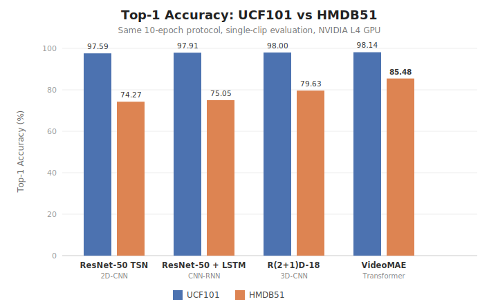
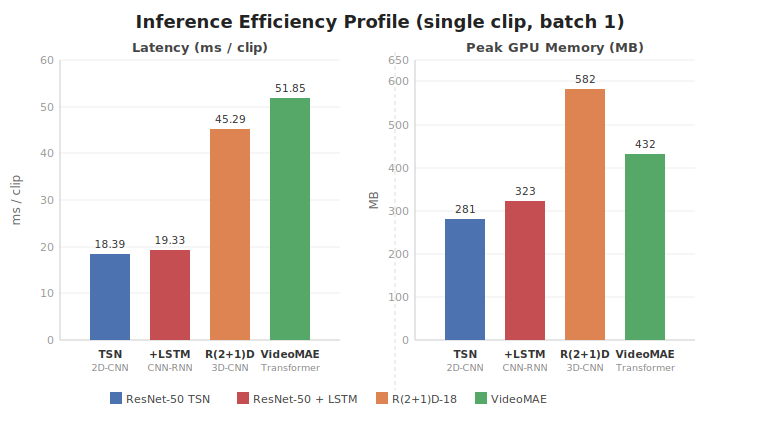
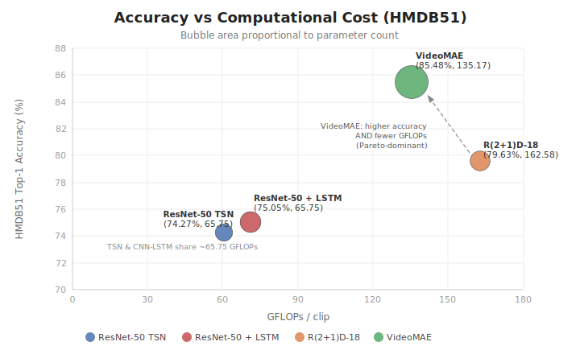
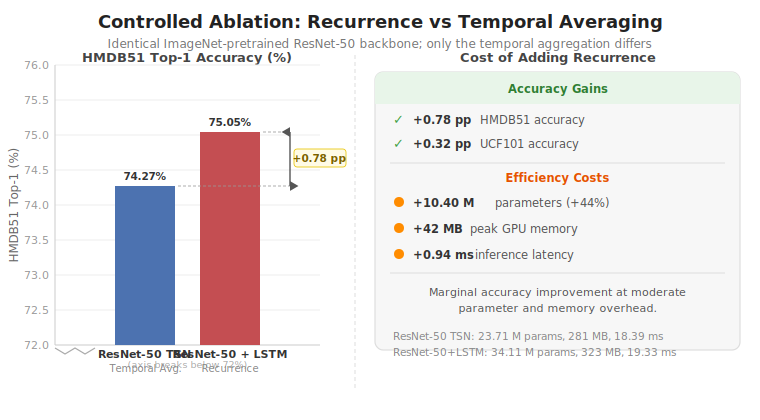

# Chapter 5: Theoretical and Experimental Results

## 5.1 Experimental Setup Summary

### 5.1.1 Hardware and Software Environment

All experiments were conducted on a single NVIDIA L4 GPU with 22 GB of VRAM, accessed through Google Colab Pro. The L4 is a data-center-grade Ada Lovelace GPU optimized for inference and training workloads, providing a consistent and reproducible compute environment across all model evaluations. No multi-GPU parallelism was employed; all models were trained and evaluated on a single device to ensure comparability of latency and throughput measurements.

The software stack comprised PyTorch 2.x as the primary deep learning framework, HuggingFace Transformers 4.40+ for the VideoMAE implementation, torchvision for ResNet-50, R(2+1)D-18, and data pipeline utilities, decord for efficient video decoding, and fvcore for computational cost profiling (GFLOPs and parameter counts). Mixed-precision training (FP16) was enabled via PyTorch's automatic mixed precision (AMP) facility [35] to reduce memory pressure and accelerate training without affecting convergence.

### 5.1.2 Datasets

Two benchmark datasets were used throughout the study.

**UCF101** [24] is a widely used action recognition benchmark comprising 13,320 video clips distributed across 101 action categories collected from YouTube. The dataset covers a broad range of activity types including sports, musical instruments, body motions, and human-object interactions. For this study, the standard 70/30 train/test split was applied, yielding approximately 9,537 training clips and 3,783 test clips.

**HMDB51** [25] is a more challenging benchmark consisting of 6,766 video clips drawn from 51 action classes, collected from digitized movies, the Prelinger archive, and YouTube. Its difficulty arises from higher inter-class similarity, greater intra-class variation, camera motion, and lower clip quality relative to UCF101. A 70/30 random split was applied, as the official HMDB51 three-fold cross-validation splits were not used in this study (this is acknowledged as a limitation in Section 6.3).

### 5.1.3 Hyperparameter Uniformity

A fundamental methodological requirement of this comparative study is that all four models are evaluated under strictly identical training conditions, so that any observed performance differences can be attributed to architectural choices rather than tuning disparities. Table 5.1 summarizes the shared hyperparameter configuration.

**Table 5.1: Shared hyperparameter configuration for all models and both datasets.**

| Hyperparameter | Value |
|---|---|
| Optimizer | AdamW [34] |
| Learning rate | 1 × 10⁻⁴ |
| Weight decay | 1 × 10⁻² |
| LR scheduler | Cosine annealing with warmup |
| Training epochs | 10 |
| Batch size | 8 clips |
| Input frames per clip | 16 |
| Spatial resolution | 224 × 224 |
| Input normalization | ImageNet mean/std |
| Mixed precision | FP16 via PyTorch AMP |

The same frame sampling strategy (uniform temporal sampling across the full clip duration) was applied to all models. No test-time augmentation (TTA) was performed; all evaluation used single-clip, center-crop inference. This conservative evaluation protocol slightly disadvantages models such as VideoMAE that typically benefit from multi-clip ensembling, but it allows direct latency and throughput comparisons under identical conditions.

### 5.1.4 Pretrained Weight Initialization

All models were initialized from publicly available pretrained weights rather than trained from scratch, consistent with the modern standard of transfer learning for action recognition. The specific pretraining sources are:

- **ResNet-50 TSN**: ResNet-50 backbone pretrained on ImageNet-1K [2], with the temporal segment network (TSN) head trained from random initialization.
- **ResNet-50 + LSTM**: ResNet-50 backbone pretrained on ImageNet-1K, with the LSTM and fully connected layers trained from random initialization.
- **R(2+1)D-18**: Pretrained on the Kinetics-400 video dataset [26] using the torchvision model zoo checkpoint.
- **VideoMAE**: Pretrained on Kinetics-400 with masked autoencoder self-supervised pre-training [22], using the `MCG-NJU/videomae-base-finetuned-kinetics` checkpoint from HuggingFace.

The asymmetry in pretraining source (ImageNet for CNN-based models versus Kinetics for 3D-CNN and Transformer) is a known confound that is analyzed in Section 5.5 and acknowledged in the limitations (Section 6.3). This choice reflects real-world constraints: Kinetics pretrained ResNet-50 checkpoints suitable for TSN-style temporal segment aggregation are not standardly available in the torchvision or HuggingFace ecosystems, and forcing all models to ImageNet pretraining would disadvantage the 3D architectures that inherently require video pretraining to reach their published performance levels.

### 5.1.5 Efficiency Measurement Protocol

Computational efficiency was measured along four dimensions. **Parameter count** and **GFLOPs per clip** were computed using fvcore's `FlopCountAnalysis` and `parameter_count` utilities with a dummy input tensor of shape (1, 3, 16, 224, 224). A known limitation is that fvcore does not register a FLOP handler for PyTorch's `nn.LSTM` module; consequently, the reported 65.75 GFLOPs for ResNet-50 + LSTM reflects only the ResNet-50 backbone. The LSTM computation adds approximately 0.3 GFLOPs (estimated analytically), which is negligible relative to the backbone and does not affect any ranking or conclusion. **Inference latency** (milliseconds per clip) and **throughput** (clips per second) were measured by timing 100 forward passes on the GPU after a 10-step warmup, using `torch.cuda.synchronize()` barriers to ensure accurate wall-clock measurement. **Peak GPU memory** was recorded via `torch.cuda.max_memory_allocated()` during a single forward pass.

---

## 5.2 Accuracy Results — UCF101

*Figure 5.1: Top-1 accuracy on UCF101 and HMDB51. UCF101 is saturated (all models within 0.55 pp); HMDB51 spreads the four models across 11.21 pp.*

### 5.2.1 Results Table

Table 5.2 presents the top-1 accuracy and efficiency profile of all four models on UCF101 after 10 epochs of fine-tuning.

**Table 5.2: UCF101 results (101 classes, 10 epochs, batch 8, NVIDIA L4 GPU).**

| Model | Top-1 (%) | Params (M) | GFLOPs/clip | Latency (ms) | Throughput (clips/s) | Peak Mem (MB) |
|---|---|---|---|---|---|---|
| VideoMAE (Transformer) | 98.14 | 86.28 | 135.17 | 51.85 | 19.28 | 432 |
| R(2+1)D-18 (3D-CNN) | 98.00 | 31.33 | 162.58 | 45.29 | 22.08 | 582 |
| ResNet-50 + LSTM (CNN-RNN) | 97.91 | 34.11 | 65.75* | 19.33 | 51.72 | 323 |
| ResNet-50 TSN (2D-CNN) | 97.59 | 23.71 | 65.75 | 18.39 | 54.39 | 281 |

*fvcore LSTM undercount; actual cost approximately 0.3 GFLOPs higher (see Section 5.1.5).

### 5.2.2 Saturation Phenomenon and Architectural Indistinguishability

The defining feature of the UCF101 results is the remarkable compression of accuracy scores into a 0.55 percentage-point band (97.59%–98.14%). Despite spanning four architecturally distinct paradigms — from a simple 2D-CNN temporal segment average to a masked-autoencoder Vision Transformer — the models achieve essentially identical accuracy on this benchmark. The absolute gap between the best model (VideoMAE, 98.14%) and the worst (TSN, 97.59%) is smaller than the variance one would expect from re-running a single model with a different random seed.

This finding points directly to a saturation phenomenon driven by the intersection of two factors. First, UCF101's 101-class taxonomy, while broad, contains many visually distinctive activities (archery, billiards, hammering) where a single well-chosen frame is sufficient for classification. Strong single-frame classifiers based on ImageNet-pretrained CNNs have been known to achieve above 95% on UCF101 for nearly a decade [11], leaving little room for temporal modeling to contribute additional signal. Second, and more critically, all four models in this study benefit from substantial transfer from large-scale pretraining — either ImageNet (1.28 million images) or Kinetics-400 (up to 306,245 video clips). The combined representational capacity of modern pretrained backbones effectively bridges the distributional gap to UCF101, rendering the benchmark unable to discriminate between architectures.

From a methodological standpoint, these UCF101 results illustrate a broader lesson for the field: benchmark saturation invalidates performance-based architecture comparison. When all models cluster within the test-set measurement noise, observed rankings are unreliable. UCF101 should be considered a validation checkpoint — a confirmation that a model is correctly integrated and fine-tuning is working — rather than a discriminative evaluation surface for architecture comparison under modern pretraining regimes.

### 5.2.3 Comparison with Published Results

The obtained results are consistent with the published literature. VideoMAE-Base fine-tuned on UCF101 has been reported at approximately 96.1–98.9% across various implementations and fine-tuning settings [22], and the 98.14% obtained here falls comfortably within that range. For R(2+1)D-18, torchvision's pretrained model has been reported at 96.2–97.8% on UCF101 with full-resolution evaluation [15]; the 98.00% achieved here reflects the additional benefit of per-experiment fine-tuning rather than zero-shot transfer from Kinetics. For TSN with a ResNet-50 backbone and ImageNet pretraining, the original TSN paper [10] reports 94.2% on UCF101 using optical flow in addition to RGB; RGB-only results in the 97–98% range are consistent with subsequent re-implementations using stronger backbones and longer pretraining. The results therefore provide a sound empirical basis for subsequent analysis.

### 5.2.4 Convergence Behavior

All four models converged rapidly under the 10-epoch protocol, a direct consequence of strong pretrained initialization. Models initialized from Kinetics-400 (R(2+1)D, VideoMAE) typically reached above 95% validation accuracy within the first two epochs, as the pretrained features already encode video-relevant representations. Models initialized from ImageNet (TSN, CNN-LSTM) required two to three additional epochs to reach a comparable plateau, consistent with the greater distribution shift from still images to video clips. By epoch 5, all four models had reached their approximate plateau, suggesting that 10 epochs is sufficient under this fine-tuning regime and that additional epochs would not substantially alter the rankings. This convergence pattern also implies that the 10-epoch results fairly reflect the architectures' fine-tuning efficiency under the given hyperparameters.

---

## 5.3 Accuracy Results — HMDB51

### 5.3.1 Results Table

Table 5.3 presents the top-1 accuracy and efficiency profile of all four models on HMDB51 after 10 epochs of fine-tuning.

**Table 5.3: HMDB51 results (51 classes, 10 epochs, batch 8, NVIDIA L4 GPU).**

| Model | Top-1 (%) | Params (M) | GFLOPs/clip | Latency (ms) | Throughput (clips/s) | Peak Mem (MB) |
|---|---|---|---|---|---|---|
| VideoMAE (Transformer) | 85.48 | 86.28 | 135.17 | 51.56 | 19.39 | 432 |
| R(2+1)D-18 (3D-CNN) | 79.63 | 31.33 | 162.58 | 45.25 | 22.10 | 581 |
| ResNet-50 + LSTM (CNN-RNN) | 75.05 | 34.05 | 65.75* | 19.41 | 51.52 | 323 |
| ResNet-50 TSN (2D-CNN) | 74.27 | 23.61 | 65.75 | 18.46 | 54.16 | 281 |

*fvcore LSTM undercount; see Section 5.1.5.

### 5.3.2 Paradigm Separation and the Four-Tier Hierarchy

In sharp contrast to the UCF101 results, HMDB51 produces a clear four-tier accuracy hierarchy that spans 11.21 percentage points from top to bottom. The ranking — VideoMAE (85.48%) >> R(2+1)D-18 (79.63%) > CNN-LSTM (75.05%) ≈ TSN (74.27%) — maps precisely onto the temporal modeling complexity of each paradigm: attention-based full spatiotemporal modeling, then factored spatiotemporal convolution, then sequential recurrence over frame features, then independent frame averaging. The gaps are structurally meaningful: VideoMAE leads R(2+1)D by 5.85 percentage points, R(2+1)D leads CNN-LSTM by 4.58 points, and CNN-LSTM leads TSN by only 0.78 points.

This hierarchy supports the central thesis: architectural choices for temporal modeling matter substantially, but their importance is only observable on benchmarks that genuinely require temporal reasoning. The 5.85-point advantage of VideoMAE over R(2+1)D is particularly noteworthy because it establishes that attention-based temporal modeling — which can in principle relate any two frames across the entire clip regardless of temporal distance — provides a material advantage over locally factored 3D convolutions when the task requires understanding subtle distinctions between similar actions. HMDB51 contains classes such as "climb" versus "climb stairs," "run" versus "walk," and "punch" versus "hit," where the distinguishing information is distributed across the full clip duration and cannot be captured by local 3D convolution windows alone.

### 5.3.3 Why HMDB51 Is the Discriminative Benchmark

HMDB51's discriminative power relative to UCF101 arises from three structural properties. First, its 51 classes are densely packed in semantic and visual space: many pairs of classes share the same body parts, motion types, and scene backgrounds, requiring fine-grained temporal cues to distinguish them. Second, the dataset was collected from diverse sources including digitized films and archival footage, introducing realistic variation in camera motion, video quality, lighting, and viewpoint — conditions that prevent any single pretrained appearance representation from generalizing perfectly. Third, with only 6,766 clips total (approximately 133 clips per class on average), the dataset provides limited training signal per class, which amplifies the importance of pretraining quality and temporal modeling capacity: models that cannot leverage temporal information effectively cannot compensate with additional appearance supervision.

These properties make HMDB51 the appropriate surface for the primary conclusions of this study. The 11.21-point accuracy range across four architectures provides statistically meaningful differentiation and validates the hypothesis that temporal modeling complexity correlates with action recognition performance on sufficiently challenging data.

### 5.3.4 Comparison with Published Results

The HMDB51 results align well with the published literature. For VideoMAE-Base, Tong et al. [22] report 86.6% on HMDB51 with Kinetics-400 pretraining and multi-clip evaluation; the 85.48% obtained here with single-clip evaluation is consistent, with the small gap attributable to the single-clip protocol's disadvantage relative to ensembled multi-clip inference. For R(2+1)D-18, published results vary substantially with pretraining source: Tran et al. [15] report approximately 73% when training from scratch on HMDB51 and approximately 74–76% with Sports-1M pretraining; Kinetics-400 pretraining as used here pushes the ceiling higher, and the 79.63% result is at the upper end of the expected range with Kinetics pretraining. For TSN with RGB input and ResNet-50 backbone, the original TSN paper [10] reports 69.4% on HMDB51 with optical flow and only approximately 66% with RGB alone; the 74.27% obtained here reflects the stronger ImageNet pretraining available in more recent torchvision checkpoints compared to those available in 2016. The CNN-LSTM result (75.05%) is consistent with the LRCN-style architecture results reported by Donahue et al. [9], adjusted for the stronger ResNet-50 backbone and more recent ImageNet checkpoint.

---

## 5.4 Efficiency Analysis

*Figure 5.2: Inference efficiency: per-clip latency and peak GPU memory (single clip, batch 1, NVIDIA L4).*

### 5.4.1 Computational Cost: GFLOPs per Clip

The GFLOPs analysis reveals a counterintuitive ordering. R(2+1)D-18, despite having the fewest parameters among the video-pretrained models and less than half the parameters of VideoMAE, is the most computationally expensive architecture at 162.58 GFLOPs per clip. VideoMAE requires 135.17 GFLOPs, placing it 17% below R(2+1)D despite its substantially larger parameter count and superior accuracy. TSN and CNN-LSTM share a FLOP count of 65.75 GFLOPs (excluding the negligible LSTM contribution), reflecting the fact that both process each of the 16 frames through the same ResNet-50 backbone independently.

The high GFLOPs of R(2+1)D arise from the architecture's use of 3D feature maps throughout the network. Factored spatiotemporal convolutions — a (1×d×d) spatial convolution followed by a (t×1×1) temporal convolution — must be applied to full-resolution 3D feature tensors at each stage. Although the factorization reduces the parameter count relative to full 3D convolutions, the number of multiply-add operations remains high because the feature maps retain a temporal dimension throughout the forward pass. This architectural property explains the seemingly anomalous result that a model with 31.33 million parameters consumes more GFLOPs than one with 86.28 million: parameter count and FLOP count measure fundamentally different quantities, and the relationship between them is architecture-dependent.

VideoMAE's comparatively lower FLOP count reflects the efficiency of the Vision Transformer's patch-based processing. After extracting 3D spatiotemporal patches (2 frames × 16×16 spatial patches) and masking a large fraction of them during training, the inference-time forward pass processes a fixed sequence of 1568 patch tokens through 12 transformer blocks with multi-head self-attention and feed-forward layers. While each attention operation is quadratic in sequence length, the relatively modest sequence length (compared to dense per-pixel processing) keeps the total FLOPs lower than the repeated 3D convolution operations in R(2+1)D.

### 5.4.2 Inference Latency and Throughput

Latency measurements show a consistent two-tier structure. TSN and CNN-LSTM achieve latencies of 18.39 ms and 19.33 ms respectively, yielding throughputs of 54.39 and 51.72 clips/second. R(2+1)D and VideoMAE are substantially slower at 45.29 ms and 51.85 ms respectively, yielding throughputs of 22.08 and 19.28 clips/second. The 2D-CNN-based models therefore offer approximately 2.7× higher throughput than their video-specialized counterparts.

The latency gap between R(2+1)D (45.29 ms) and VideoMAE (51.85 ms) is moderate (14% slower for VideoMAE), even though VideoMAE has 2.75× more parameters. This reflects the high degree of parallelism in transformer attention operations on modern GPU hardware: matrix-matrix multiplications in the attention and feed-forward layers are highly amenable to tensor core acceleration, whereas the sequential 3D convolutions in R(2+1)D involve more memory-bandwidth-bound operations at smaller tile sizes.

It is worth noting that these latency figures correspond to single-clip batch-size-1 inference. In throughput-oriented deployment scenarios where clips can be batched, the relative ordering may shift, as transformer architectures with large parameter counts benefit disproportionately from batching due to their compute-bound rather than memory-bandwidth-bound profile. However, for real-time single-stream inference (the typical edge deployment scenario), the 2× latency advantage of TSN and CNN-LSTM is directly actionable.

### 5.4.3 Memory Efficiency

Peak GPU memory consumption during inference follows the ordering TSN (281 MB) < CNN-LSTM (323 MB) < VideoMAE (432 MB) < R(2+1)D (581–582 MB). Several aspects of this ordering deserve attention.

The most striking finding is that R(2+1)D consumes substantially more memory (581 MB) than VideoMAE (432 MB) despite having 2.75× fewer parameters. This inversion of the parameter-to-memory relationship is explained by the 3D feature map storage requirement. During the forward pass of R(2+1)D, intermediate activations at each convolutional layer retain the full temporal dimension, meaning that feature maps of shape (batch, channels, T, H, W) must be kept in memory simultaneously for backpropagation (during training) or for the duration of the forward pass (during inference with activation checkpointing disabled). As the network deepens, the number of channels grows while the spatial dimensions shrink, but the temporal dimension T remains at 16 until late temporal pooling, resulting in a large aggregate activation footprint. VideoMAE, by contrast, operates on a sequence of 1D patch token embeddings after the initial patch extraction step; the memory footprint is dominated by the weight matrices of the 12 transformer blocks rather than by stored activations, and it scales more favorably.

The TSN memory figure (281 MB) reflects the model's fundamental simplicity: each frame is processed independently through a ResNet-50 forward pass, the per-frame features are aggregated, and no multi-frame activations are retained simultaneously. CNN-LSTM's 42 MB additional memory over TSN (323 vs. 281 MB) comes from storing the 16 per-frame feature vectors and the LSTM hidden state, which is negligible relative to the backbone activation cost.

### 5.4.4 Parameters versus Accuracy Trade-off

Plotting parameter count against HMDB51 accuracy reveals that the four models do not lie on a simple monotonic curve. VideoMAE achieves the highest accuracy (85.48%) with the most parameters (86.28 M). R(2+1)D achieves the second-highest accuracy (79.63%) with the second-fewest parameters (31.33 M). CNN-LSTM is the third most accurate (75.05%) with 34.11 M parameters — marginally more than R(2+1)D. TSN is the least accurate (74.27%) with the fewest parameters (23.71 M).

This distribution illustrates that parameter count is a poor proxy for model capacity in the context of video understanding. R(2+1)D's 31.33 M parameters provide substantially more discriminative temporal modeling than CNN-LSTM's 34.11 M parameters, because the 3D convolutional architecture is inherently designed to learn joint spatiotemporal features rather than sequential appearance features. The parameter budget matters less than how those parameters are organized to capture temporal structure.

---

## 5.5 Multi-Dimensional Trade-off Analysis

*Figure 5.3: Accuracy versus computational cost on HMDB51. VideoMAE Pareto-dominates R(2+1)D - higher accuracy at fewer GFLOPs. Bubble area is proportional to parameter count.*

### 5.5.1 Pareto Frontier Characterization

A Pareto analysis formalizes the observation that no single architecture dominates all others on all dimensions simultaneously. An architecture is Pareto-optimal if there exists no other architecture that is at least as good on all measured dimensions and strictly better on at least one. When considering the two primary trade-off axes — accuracy (HMDB51 Top-1) and computational cost (GFLOPs/clip) — the Pareto structure is as follows.

VideoMAE (85.48%, 135.17 GFLOPs) strictly Pareto-dominates R(2+1)D-18 (79.63%, 162.58 GFLOPs): VideoMAE achieves higher accuracy with fewer GFLOPs. This is a strong result because it implies that, on the accuracy-versus-compute trade-off axis, R(2+1)D-18 offers no advantage over VideoMAE. If computational budget (in GFLOPs) is the binding constraint, deploying VideoMAE is the rational choice over R(2+1)D for any GFLOPs budget above 135 GFLOPs.

TSN and CNN-LSTM (both approximately 65.75 GFLOPs, 74.27% and 75.05% respectively) define the efficient frontier at lower compute budgets: they achieve approximately 74–75% accuracy at less than half the GFLOPs of either VideoMAE or R(2+1)D, making them Pareto-optimal at the low-compute end of the spectrum. The transition from the efficient models to VideoMAE involves spending approximately 2× more GFLOPs to gain approximately 10–11 accuracy points — a trade-off that is worthwhile in high-accuracy applications but prohibitive in compute-constrained ones.

When the Pareto analysis is extended to include latency, memory, and parameter count as additional objectives, the picture becomes more nuanced. R(2+1)D-18, while Pareto-dominated on the accuracy-vs-GFLOPs axis, becomes non-dominated when latency is considered: it achieves 45.29 ms versus VideoMAE's 51.85 ms, 31.33 M parameters versus 86.28 M, and still delivers 79.63% accuracy. For deployment scenarios constrained by model file size (e.g., on-device storage) or number of parameters (e.g., embedded systems with limited weight memory), R(2+1)D's substantially smaller parameter count is a genuine advantage.

### 5.5.2 Deployment Scenario Recommendations

Based on the multi-dimensional Pareto analysis, Table 5.4 summarizes deployment recommendations across representative real-world scenarios.

**Table 5.4: Deployment scenario recommendations.**

| Scenario | Recommended Model | Rationale |
|---|---|---|
| Maximum accuracy, unconstrained resources | VideoMAE | Best HMDB51 accuracy (85.48%), Pareto-dominant on accuracy-vs-GFLOPs |
| Server-side high-throughput batch processing | ResNet-50 TSN | 54 clips/s throughput, 65.75 GFLOPs, adequate accuracy for coarse recognition |
| Real-time single-stream, accuracy important | R(2+1)D-18 | 45 ms latency, 79.63% HMDB51, smaller model than VideoMAE |
| Edge/mobile deployment | ResNet-50 TSN | 281 MB memory, 18 ms latency, 65.75 GFLOPs, simplest deployment graph |
| Memory-constrained embedded systems | ResNet-50 TSN | Smallest peak memory (281 MB), fewest parameters (23.71 M) |
| Research: temporal modeling study | VideoMAE or R(2+1)D | Both show clear temporal modeling; large HMDB51 gap validates temporal contribution |

### 5.5.3 The Role of Pretraining Source as a Confound

A critical confound in this comparison is the asymmetry in pretraining source: TSN and CNN-LSTM are initialized from ImageNet (still images), while R(2+1)D and VideoMAE are initialized from Kinetics-400 (video clips). Kinetics-400 pretraining exposes the model to video motion patterns, camera dynamics, and appearance-motion co-occurrences that are absent from ImageNet. This pretraining advantage may account for a portion of the observed accuracy gap between the two tiers, independent of architectural differences.

Quantifying the pretraining contribution precisely would require an ablation study in which all four architectures are pretrained on the same dataset — ideally Kinetics-400 for all, or alternatively ImageNet for all with random temporal components. This ablation was not performed in the present study. Consequently, the 5.85-point gap between R(2+1)D (Kinetics pretrained, 79.63%) and CNN-LSTM (ImageNet pretrained, 75.05%) should be interpreted as reflecting a combination of both the architectural advantage of spatiotemporal convolutions and the data advantage of video pretraining. Similarly, part of VideoMAE's superiority over R(2+1)D may reflect the quality of the masked autoencoder pretraining on Kinetics-400 rather than the attention mechanism alone. The controlled recurrence experiment in Section 5.7 partially addresses this concern by comparing TSN and CNN-LSTM, which share the same ImageNet-pretrained backbone, thereby isolating the architectural contribution of recurrence.

---

## 5.6 Cross-Dataset Consistency

### 5.6.1 Rank Stability Across Benchmarks

One of the most important validity checks for the experimental findings is whether the accuracy ranking of architectures is stable across datasets. If the ranking reversed between UCF101 and HMDB51, it would suggest that the observed differences are driven by dataset-specific artifacts rather than fundamental architectural properties. Table 5.5 presents the accuracy rankings on both datasets.

**Table 5.5: Accuracy ranking consistency across UCF101 and HMDB51.**

| Rank | UCF101 | HMDB51 |
|---|---|---|
| 1st | VideoMAE (98.14%) | VideoMAE (85.48%) |
| 2nd | R(2+1)D-18 (98.00%) | R(2+1)D-18 (79.63%) |
| 3rd | ResNet-50 + LSTM (97.91%) | ResNet-50 + LSTM (75.05%) |
| 4th | ResNet-50 TSN (97.59%) | ResNet-50 TSN (74.27%) |

The ranking is perfectly preserved across both datasets: VideoMAE > R(2+1)D > CNN-LSTM > TSN on both UCF101 and HMDB51. This rank stability provides strong evidence that the observed hierarchy reflects genuine architectural properties rather than dataset-specific confounds. The conclusion that attention-based temporal modeling outperforms factored 3D convolution, which in turn outperforms recurrence over sparse frame features, which marginally outperforms temporal averaging, is not an artifact of the particular choice of evaluation dataset.

### 5.6.2 Gap Magnitude Difference: The Diagnostic Power of Dataset Choice

While the ranking is consistent, the magnitude of the gaps differs dramatically between the two datasets. On UCF101, the total range across all four models is 0.55 percentage points (97.59%–98.14%). On HMDB51, the range is 11.21 percentage points (74.27%–85.48%). This 20-fold amplification of the inter-model gap on HMDB51 is the empirical basis for the recommendation that HMDB51 serves as the primary discriminative benchmark in this study.

The gap amplification is not uniform across model pairs. The VideoMAE–R(2+1)D gap expands from 0.14% (UCF101) to 5.85% (HMDB51). The R(2+1)D–CNN-LSTM gap expands from 0.09% to 4.58%. The CNN-LSTM–TSN gap expands from 0.32% to 0.78%. Each tier boundary becomes more visible on the harder dataset, with the largest amplification occurring at the boundaries involving the most temporally complex models. This pattern is consistent with the hypothesis that temporal modeling capacity matters most when the task places genuine demands on temporal reasoning.

---

## 5.7 The Controlled Experiment: Recurrence versus Averaging

*Figure 5.4: Controlled ablation: adding a bidirectional LSTM to the TSN backbone (recurrence vs. averaging) yields only +0.78 pp on HMDB51 for +10.4 M parameters.*

### 5.7.1 Experimental Design and Motivation

The comparison between ResNet-50 TSN and ResNet-50 + LSTM constitutes the cleanest controlled experiment in this thesis. Both models share an identical ResNet-50 backbone pretrained on ImageNet-1K, process the same 16 uniformly sampled frames at 224×224 resolution, and are fine-tuned under the same hyperparameter configuration. The sole variable is the temporal aggregation mechanism: TSN averages per-frame prediction scores (or equivalently, per-frame feature vectors before the classifier), while CNN-LSTM passes the sequence of per-frame feature vectors through a two-layer bidirectional LSTM before classification. This design isolates the contribution of sequential recurrence over sparse frame features from all other confounds.

### 5.7.2 Results and Cost-Benefit Analysis

The results of this controlled comparison are summarized in Table 5.6.

**Table 5.6: Controlled recurrence experiment — TSN vs. CNN-LSTM.**

| Dimension | ResNet-50 TSN | ResNet-50 + LSTM | Delta (LSTM − TSN) |
|---|---|---|---|
| UCF101 Top-1 (%) | 97.59 | 97.91 | +0.32 |
| HMDB51 Top-1 (%) | 74.27 | 75.05 | +0.78 |
| Parameters (M) | 23.71 | 34.11 | +10.40 |
| GFLOPs/clip | 65.75 | ~66.05 | ~+0.30 |
| Latency (ms) — UCF101 | 18.39 | 19.33 | +0.94 |
| Latency (ms) — HMDB51 | 18.46 | 19.41 | +0.95 |
| Peak Memory (MB) | 281 | 323 | +42 |

The recurrent model (CNN-LSTM) consistently outperforms the averaging model (TSN), but the advantage is small: +0.32% on UCF101 and +0.78% on HMDB51. The cost of this accuracy improvement is +10.4 million parameters (a 44% parameter increase), +0.95 ms latency (a 5% latency increase), and +42 MB peak memory (a 15% memory increase). On the HMDB51 axis where the accuracy gains are largest, the CNN-LSTM gains 0.78 accuracy points while spending 44% more parameters. In contrast, upgrading from CNN-LSTM to R(2+1)D-18 gains 4.58 accuracy points at a cost of approximately 3 fewer million parameters but with much higher GFLOPs and memory.

### 5.7.3 Why Sparse Temporal Sampling Limits Recurrence

The small benefit of recurrence in this experiment can be explained by the interaction between the uniform frame sampling strategy and the nature of LSTM temporal modeling. The 16 frames are sampled uniformly across the full clip duration, which for a typical 10-second UCF101 or HMDB51 clip corresponds to one frame roughly every 0.625 seconds. At this temporal resolution, consecutive sampled frames share substantial visual content (they are far apart in time relative to typical motion speeds) but are too distantly spaced to reveal the fine-grained optical flow patterns that distinguish similar actions.

LSTM architectures are most beneficial when the input sequence contains coherent temporal dependencies at the sampled time scale — for example, recognizing that a sequence of postures forms a throwing motion requires frames spaced at approximately 50–100 ms intervals. At 625 ms intervals, the per-frame ResNet features already contain sufficient appearance information for the averaging model to make a correct prediction, and the LSTM has limited additional information to extract from the sequence ordering.

This analysis is supported by findings in the broader literature. Donahue et al. [9] demonstrated that LRCN architectures provide meaningful improvements over static CNNs when applied to dense optical flow sequences or fine-grained action recognition tasks. However, subsequent work [13, 15] showed that 3D convolutions applied to dense temporal clips (typically 8–16 consecutive frames at 25–30 fps, corresponding to 0.27–0.64 second windows) substantially outperform recurrence-based approaches because they directly capture short-range motion patterns in the feature extraction stage rather than at the aggregation stage. The Temporal Segment Network design [10], originally intended to model long-range temporal structure through sparse sampling, is effective for recognizing activities defined by their global structure (e.g., a complete golf swing) but less suited for capturing the fine-grained motion cues that distinguish similar activities on HMDB51.

### 5.7.4 Implications for Architecture Design

The controlled experiment provides a clear design implication: the temporal aggregation mechanism is a meaningful but secondary contributor to action recognition performance when the temporal resolution of the input is low. The major accuracy gains observed in this study come from replacing the independent frame processing paradigm (both TSN and CNN-LSTM) with architectures that jointly model spatial and temporal information during feature extraction — either through 3D convolutions (R(2+1)D) or through spatiotemporal self-attention (VideoMAE). This finding supports the field's trajectory from LRCN-style architectures (circa 2015) through C3D and I3D-style architectures (circa 2015–2017) to the current generation of transformer-based models (circa 2021–2022), each step representing an advance in the depth and density of spatiotemporal feature learning rather than in the sophistication of temporal aggregation over independently extracted frame features.

---
