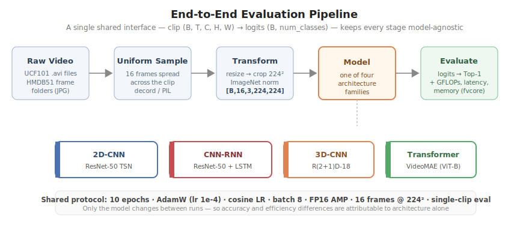
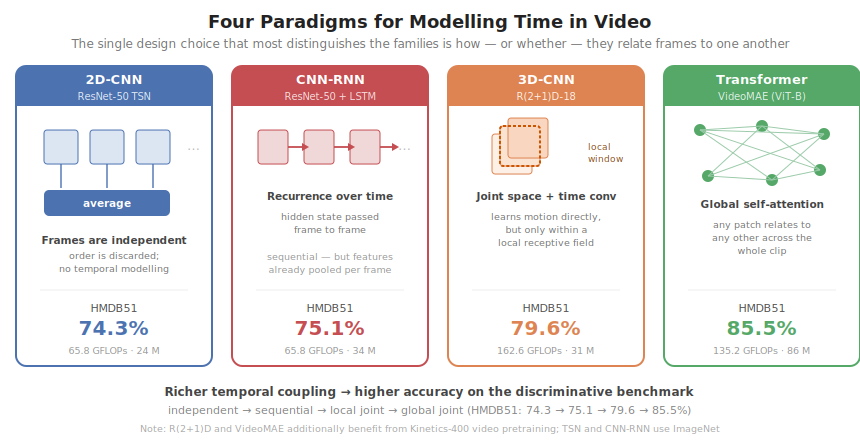

# Master's Dissertation — Chapters

**Comparative Analysis of Deep Learning Architectures for Human Action Recognition: CNNs, RNNs, 3D-CNNs, and Transformers**

Andrei Brehuescu · Technical University of Cluj-Napoca, Faculty of Automation and Computer Science · 2025–2026

The dissertation is split into one Markdown file per chapter, with all figures under [`figures/`](figures/).

## Contents

| # | Chapter | File |
|---|---------|------|
| — | Title & Abstract | [00-abstract.md](00-abstract.md) |
| 1 | Introduction | [01-introduction.md](01-introduction.md) |
| 2 | Research Objectives and Scope | [02-objectives.md](02-objectives.md) |
| 3 | Literature Review and State of the Art | [03-literature-review.md](03-literature-review.md) |
| 4 | Project Presentation | [04-project-presentation.md](04-project-presentation.md) |
| 5 | Theoretical and Experimental Results | [05-results.md](05-results.md) |
| 6 | Conclusions | [06-conclusions.md](06-conclusions.md) |
| — | Bibliography | [bibliography.md](bibliography.md) |
| — | Appendices A–C | [appendices.md](appendices.md) |

## System at a glance





## Figures

| File | Appears in | Shows |
|------|-----------|-------|
| [fig01-system-pipeline.svg](figures/fig01-system-pipeline.svg) | Ch 4 | End-to-end evaluation pipeline (shared interface) |
| [fig02-tsn.svg](figures/fig02-tsn.svg) | Ch 4 | ResNet-50 TSN — per-frame logits, temporal average |
| [fig03-cnn-lstm.svg](figures/fig03-cnn-lstm.svg) | Ch 4 | ResNet-50 + bidirectional LSTM (LRCN) |
| [fig04-r2plus1d.svg](figures/fig04-r2plus1d.svg) | Ch 4 | R(2+1)D-18 — (2+1)D convolution factorisation |
| [fig05-videomae.svg](figures/fig05-videomae.svg) | Ch 4 | VideoMAE — tubelet tokens + MAE pretraining + ViT |
| [fig06-four-paradigms.svg](figures/fig06-four-paradigms.svg) | Ch 1 | How each family models the temporal dimension |
| [fig07-accuracy-comparison.svg](figures/fig07-accuracy-comparison.svg) | Ch 5 | Top-1 accuracy, UCF101 vs HMDB51 |
| [fig08-pareto-hmdb51.svg](figures/fig08-pareto-hmdb51.svg) | Ch 5 | Accuracy vs GFLOPs Pareto frontier (HMDB51) |
| [fig09-efficiency-profile.svg](figures/fig09-efficiency-profile.svg) | Ch 5 | Latency and peak-memory profile |
| [fig11-recurrence-ablation.svg](figures/fig11-recurrence-ablation.svg) | Ch 5 | Controlled recurrence-vs-averaging ablation |

All figures are hand-authored static SVG — they render directly on GitHub and scale cleanly for PDF export.

## Rebuilding a single document

The chapters are plain Markdown and the figure paths are relative, so they can be concatenated back into one file (e.g. for PDF export with `pandoc`):

```bash
cd docs/thesis
cat 00-abstract.md 01-introduction.md 02-objectives.md 03-literature-review.md \
    04-project-presentation.md 05-results.md 06-conclusions.md \
    bibliography.md appendices.md > thesis_full.md
# then, optionally:
# pandoc thesis_full.md -o thesis.pdf
```
